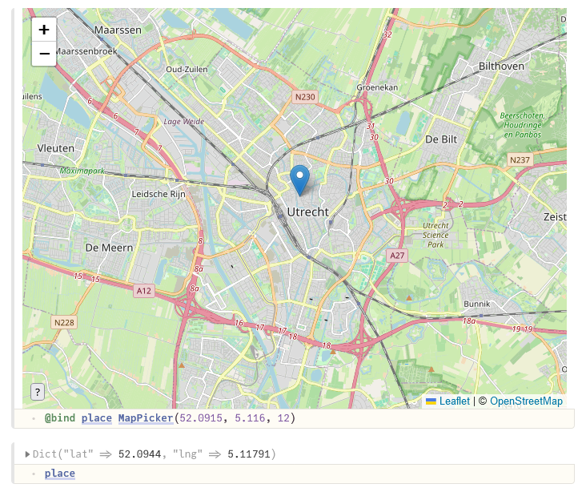

# PlutoMapPicker

A simple location picker widget for Pluto.jl notebooks. It creates an interactive map using [Leaflet](https://leafletjs.com/).



## Prerequisites

PlutoMapPicker is a package for [Julia](https://julialang.org/). It is is designed to be used in [Pluto notebooks](https://github.com/fonsp/Pluto.jl). If you are using Pluto, you're ready to use this package!

### Using PlutoMapPicker outside of Pluto

It is possible to use `PlutoMapPicker` in Julia without Pluto. If you don't have the benefit of Pluto's package manager, you can install it with:

```julia
using Pkg
Pkg.add("PlutoMapPicker")
```

## Usage

PlutoMapPicker is designed to be simple to use. Basic usage looks like this:

```julia
using PlutoMapPicker

# to pick a single location
@bind place MapPicker(0.0, 0.0, 1)

# to pick multiple locations
@bind places MapPickerMultiple(0.0, 0.0, 1)
```

For both `MapPicker` and `MapPickerMultiple`, the input parameters are the initial coordinates that the map should centre on, and the zoom level.

### Tile layer

Maps use a _raster tile layer_ to show the actual map. This layer is built of images of the world map. To load in these tiles as needed, the map must request the tiles from an API.

The default setting will request tiles from [Open Street Map](https://openstreetmap.org), but you can change this setting. The package also includes some ready-to-go configurations for [Stadia Maps](https://stadiamaps.com/). For example:

```julia
MapPicker(0.0, 0.0, 1; tile_layer=stadia_tile_layers.outdoors)
```

You can also create a custom `TileLayer` to use a different server or make requests with an API key.

Please note that PlutoMapPicker is not affiliated with Open Street Map or Stadia Maps. The `TileLayer` configurations for these services are provided for convenience, but it is up to you whether the way you're using these services complies with their usage policy. See [Open Street Map's usage policy](https://operations.osmfoundation.org/policies/tiles/) and [Stadia Map's documentation](https://docs.stadiamaps.com/) for more information.

## Licence

This package is shared under an MIT licence. See [LICENSE](./LICENSE) for more information.

## Other packages

📍 Looking for a way to pick coordinates on an image? Check out https://github.com/fonsp/PlutoImageCoordinatePicker.jl
